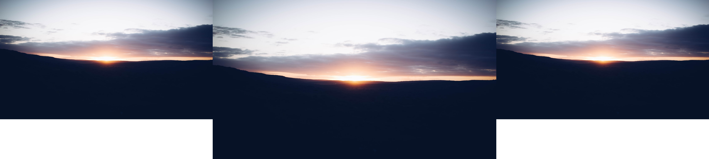

# Kopemon
Super simple script to map one image to multiple monitors for use with betterlockscreen

# Example
Example for a multi-monitor setup (1920x1080, 2560x1440, 1920x1080)
```
python3 kopemon.py 1920x1080,2560x1440,1920x1080 /path/to/image.png
```
Input: 

Output: 

